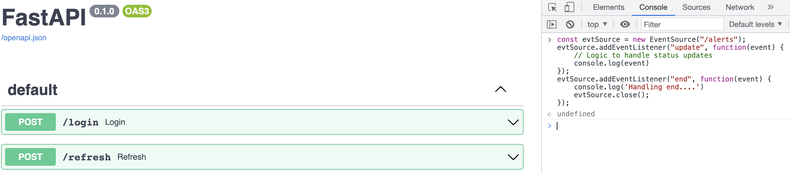
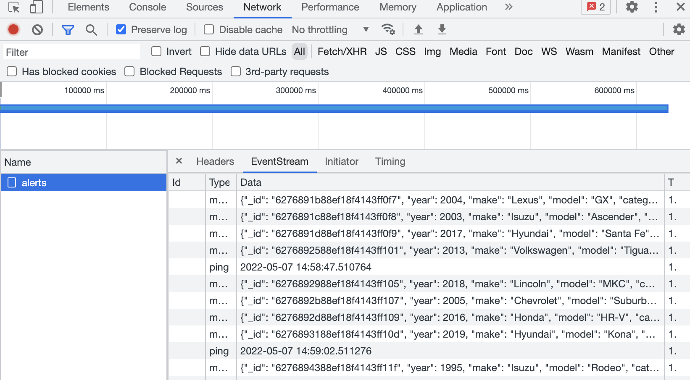

# vehicle_detector

## Deploy solution
### Set Admin password for FastAPI
Change ADMIN_USERNAME and ADMIN_PASSWORD env var in *docker/docker-compose.indexer.yml*

## Run Containers
### Create intellisite network
```
docker network create intellisite
```
### Start Broker

- Spin up the local single-node Kafka cluster (will run in the background):
```bash
$ docker-compose -f docker/docker-compose.kafka.yml up -d
```
### Start Producer
```bash
$ docker-compose -f docker/docker-compose.producer.yml up -d
```
### Start Indexer and API Rest
```
docker-compose -f docker/docker-compose.indexer.yml up -d
```
## Create admin user for FastAPI
```
curl --request GET 'http://localhost/users/create-superuser'
```
and check documentation in swagger endopoint

```http://localhost/docs```

you can test stream-event /alerts by running this script in web inspector inside /docs
```
const evtSource = new EventSource("/alerts");
evtSource.addEventListener("update", function(event) {
    // Logic to handle status updates
    console.log(event)
});
evtSource.addEventListener("end", function(event) {
    console.log('Handling end....')
    evtSource.close(); 
});

```




and view data in network tab
